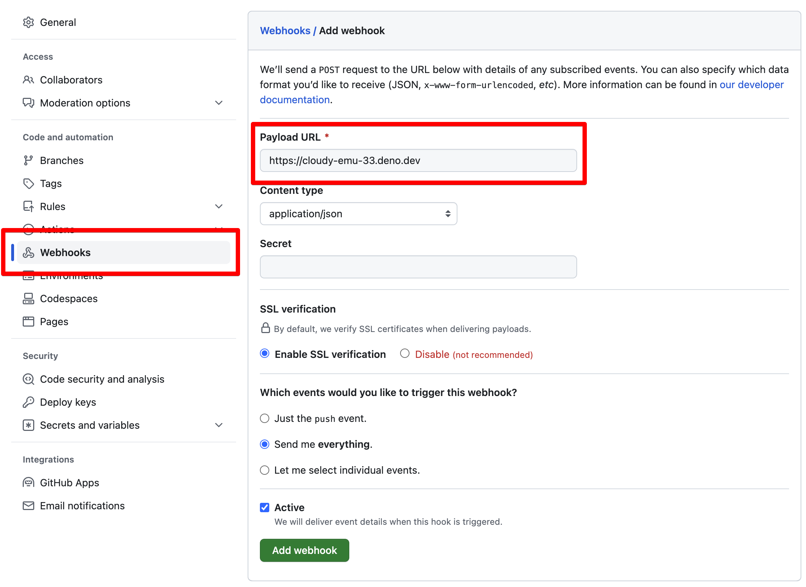

# Offload webhook processing to a queue

In a web application, it is often desirable to offload processing of async tasks
for which a client doesn't need an immediate response to a queue. Doing so can
keep your web app fast and responsive, instead of taking up valuable resources
waiting for long-running processes to complete.

One instance where you might want to deploy this technique is when
[handling webhooks](https://en.wikipedia.org/wiki/Webhook). Immediately upon
receiving the webhook request from a non-human client that doesn't need a
response, you can offload that work to a queue where it can be handled more
efficiently.

In this tutorial, we'll show you how to execute this technique when
[handling webhook requests for a GitHub repo](https://docs.github.com/en/webhooks/about-webhooks-for-repositories).
Y

## Try in a playground

✏️
[**Check out the this playground, which implements a GitHub repo webhook handler**](https://dash.deno.com/playground/github-webhook-example).

Using Deno Deploy [playgrounds](/deploy/manual/playgrounds), you can instantly
deploy your own GitHub webhook handler that uses both queues and Deno KV. We'll
walk through what this code does in a moment.

## Configuring GitHub webhooks for a repository

To try out the webhook you just launched in a playground, set up a new webhook
configuration for a GitHub repository you control. You can find webhook
configuration under "Settings" for your repository.



## Code walkthrough

Our webhook handler function is relatively simple - without comments, it's only
23 lines of code total. It connects to a Deno KV database, sets up a queue
listener to process incoming messages, and sets up a simple server with
[`Deno.serve`](https://deno.land/api?s=Deno.serve) which responds to incoming
webhook requests.

Read along with the comments below to see what's happening at each step.

```ts title="server.ts"
// Get a handle for a Deno KV database instance. KV is built in to the Deno
// runtime, and is available with zero config both locally and on Deno Deploy
const kv = await Deno.openKv();

// Set up a listener that will handle work that is offloaded from our server.
// In this case, it's just going to add incoming webhook payloads to a KV
// database, with a timestamp.
kv.listenQueue(async (message) => {
  await kv.set(["github", Date.now()], message);
});

// This is a simple HTTP server that will handle incoming POST requests from
// GitHub webhooks.
Deno.serve(async (req: Request) => {
  if (req.method === "POST") {
    // GitHub sends webhook requests as POST requests to your server. You can
    // configure GitHub to send JSON in the POST body, which you can then parse
    // from the request object.
    const payload = await req.json();
    await kv.enqueue(payload);
    return new Response("", { status: 200 });
  } else {
    // If the server is handling a GET request, this will just list out all the
    // webhook events that have been recorded in our KV database.
    const iter = kv.list<string>({ prefix: ["github"] });
    const github = [];
    for await (const res of iter) {
      github.push({
        timestamp: res.key[1],
        payload: res.value,
      });
    }
    return new Response(JSON.stringify(github, null, 2));
  }
});
```
